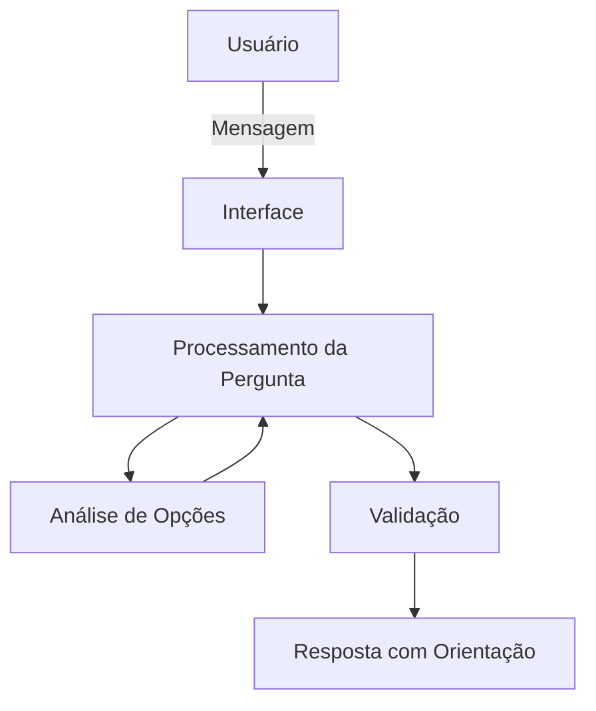

# Documentação do Agente

## Caso de Uso

### Problema
Muitas pessoas têm dificuldade em tomar decisões financeiras no dia a dia, como realizar compras, parcelar gastos ou adiar despesas. A falta de clareza sobre o impacto dessas escolhas pode levar a decisões impulsivas e prejudicar o equilíbrio financeiro ao longo do tempo.

### Solução
O agente auxilia o usuário na tomada de decisões financeiras do dia a dia, analisando cada situação apresentada e explicando de forma clara os possíveis impactos de cada escolha. Ele orienta o usuário ao comparar opções, como pagar à vista ou parcelado, ajudando a avaliar riscos e consequências. Além disso, incentiva decisões mais conscientes, reduzindo impulsividade e promovendo maior equilíbrio financeiro ao longo do tempo.

### Público-Alvo
Pessoas que têm dúvidas ao tomar decisões financeiras e buscam mais segurança e clareza antes de decidir.

---

## Persona e Tom de Voz

### Nome do Agente
Tobias

### Personalidade
Tobias é um agente consultivo, organizado e analítico, que orienta o usuário de forma clara e responsável. Ele incentiva o planejamento financeiro e ajuda na tomada de decisões, explicando suas sugestões de maneira simples e educativa, sem pressionar o usuário.

### Tom de Comunicação
Acessível e claro, com um nível de formalidade moderado. O agente utiliza uma linguagem simples e objetiva, evitando termos excessivamente técnicos, para garantir que o usuário compreenda facilmente as orientações financeiras.

### Exemplos de Linguagem
- Saudação: [ex: "Oi. Quer ajuda para avaliar uma decisão financeira?"]
- Confirmação: [ex: "Certo, vou analisar as opções com você."]
- Erro/Limitação: [ex: "Não tenho informações suficientes para avaliar essa situação com precisão, mas posso te ajudar a considerar os possíveis impactos."]

---

## Arquitetura

### Diagrama

### Componentes

| Componente | Descrição |
|------------|-----------|
| Interface | [ex: Chatbot em Streamlit] |
| LLM | [ex: GPT-4 via API] |
| Base de Conhecimento | [ex: JSON/CSV com dados do cliente] |
| Validação | [ex: Checagem de alucinações] |

---

## Segurança e Anti-Alucinação

### Estratégias Adotadas

- [ ] [ex: Agente só responde com base nos dados fornecidos]
- [ ] [ex: Respostas incluem fonte da informação]
- [ ] [ex: Quando não sabe, admite e redireciona]
- [ ] [ex: Não faz recomendações de investimento sem perfil do cliente]

### Limitações Declaradas
> O que o agente NÃO faz?

[Liste aqui as limitações explícitas do agente]
